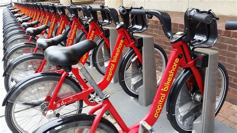

# Author

Diana Aranha

## Date created

July 30, 2020.

### Project Title

Bikeshare

### Bikeshare Image

<figure>
    
    <figcaption>
        <a href ="https://upload.wikimedia.org/wikipedia/commons/5/54/Capital_Bikeshare_station_outside_Eastern_Market_Metro.jpg">
        https://upload.wikimedia.org/wikipedia/commons/5/54/Capital_Bikeshare_station_outside_Eastern_Market_Metro.jpg</a>
    </figcaption>
</figure>

### Description

A Python script is used to explore data related to bike share systems for three major cities in the United States :  
Chicago, New York City, and Washington. 

More specifically, the Python code: 
a. processes a raw input file specific to one of the cities 
b. imports the data 
c. obtains user input to create an interactive experience 
d. computes descriptive statistics and 
e. displays it to the console 

### Files used

| Python File   |  Data Files            |
| ------------- |  --------------------- |
| bikeshare.py  |  1. chicago.csv        |
|               |  2. new_york_city.csv  |
|               |  3. washington.csv     |

### Software and OS

| Software         |  version          |
|------------------|-------------------|
| 1. python        |  3.7.6            |
| 2. anaconda      |  4.8.3            |
| 3. pandas        |  1.0.1            |
| 4. numpy         |  1.18.1           |
| 5. prettytable   |  0.7.2            |
| 6. git           |  2.27.0.windows.1 |
| 7. visual studio |  1.46.1           |
| 8. Windows 10    |  Pro 64 bit       |

### Programming Environment Setup

If  one is a novice Python user please refer to the following links: 
for Windows 10, Mac OS, and Linux

1. How to Set Up Python on Windows 10 
&nbsp;By Afam Onyimadu / Sep 13, 2018 / Windows 
&nbsp;<https://www.maketecheasier.com/set-up-python-windows10/> 

2. How to Set Up a Python Development Environment on Windows 
&nbsp;<https://www.davidbaumgold.com/tutorials/set-up-python-windows/> 

3. How to create a Python 3 virtual environment in Windows 10, November 15, 2018 
&nbsp;<https://www.techcoil.com/blog/how-to-create-a-python-3-virtual-environment-in-windows-10/> 

4. Python Setup For Mac OS, July 26, 2020 
&nbsp;<https://www.youtube.com/watch?v=qBm22KU1-f4>

5. The right and wrong way to set Python 3 as default on a Mac, 01 May 2019 
&nbsp;<https://opensource.com/article/19/5/python-3-default-mac>

6. How to Setup Python Development Environment in Ubuntu and Fedora 
&nbsp;BY ARINDAM - UPDATED ON JUNE 8, 2020 
&nbsp;<https://www.debugpoint.com/2020/06/setup-python-environment-ubuntu-fedora/>

### Run Program

Move to the bikeshare directory and at the command line enter bikeshare.py and follow instructions (user prompts)

### Python Functions

| Input Functions                     | Features                                                                                    |
|-------------------------------------|---------------------------------------------------------------------------------------------|
| 1. main()                           | 1a. Starts program                                                                          |
|                                     | 1b. Invokes functions:                                                                      |
|                                     | &nbsp;&nbsp;&nbsp;&nbsp;&nbsp;1b.1  get_filters()                                           |
|                                     | &nbsp;&nbsp;&nbsp;&nbsp;&nbsp;1b.2  load_data(city, month, day)                             |
|                                     | &nbsp;&nbsp;&nbsp;&nbsp;&nbsp;1b.3  show_raw_data(df)                                       |
|                                     | &nbsp;&nbsp;&nbsp;&nbsp;&nbsp;1b.4  time_stats(df)                                          |
|                                     | &nbsp;&nbsp;&nbsp;&nbsp;&nbsp;1b.5  station_stats(df)                                       |
|                                     | &nbsp;&nbsp;&nbsp;&nbsp;&nbsp;1b.6  trip_duration_stats(df)                                 |
|                                     |**Note: the input parameter df denotes dataframe**                                           |
|                                     |                                                                                             |
| 2. get_filters()                    | 2a. Requests user to specify city, month and day                                            |
|                                     | 2b. Invokes checkValid_Input(inputMsg, nameList, name, limit)                               |
|                                     | &nbsp;&nbsp;&nbsp;&nbsp;&nbsp;&nbsp;provides above input parameters                         |
|                                     | &nbsp;&nbsp;&nbsp;&nbsp;&nbsp;&nbsp;specific to city, month, and day                        |  
|                                     |                                                                                             |
| 3. check_Valid_Input (              | 3a. used to process the city, month, and day                                                |
|    inputMsg, nameList, name, limit) | 3b. checks if user input is valid                                                           |
|                                     | 3c. throws Exception errors for invalid input                                               |
|                                     | 3d. allows user to exit program                                                             |
|                                     |                                                                                             |
| 4. load_data(city, month, day)      | 4a. Loads the data file for the chosen city, month and day                                  |
|                                     | 4b. Uses pandas and datetime to adjust the 'Start Time' and                                 |
|                                     | &nbsp;&nbsp;&nbsp;&nbsp;&nbsp;&nbsp;'End Time' columns in the dataframe                     |
|                                     | 4c. Extracts month and day                                                                  |
|                                     | 4c. filters out weekend days - Saturday and Sunday                                          |
|                                     |                                                                                             |
| 5. show_raw_data(df)                | 5a. Displays raw data for bikeshare                                                         |
|                                     | &nbsp;&nbsp;&nbsp;&nbsp;&nbsp;&nbsp;5a.1 User can choose to display raw data                |
|                                     | &nbsp;&nbsp;&nbsp;&nbsp;&nbsp;&nbsp;5a.2 Starts from 0 to total rows and increments by 5    |
|                                     | &nbsp;&nbsp;&nbsp;&nbsp;&nbsp;&nbsp;5a.3 For each row : obtain raw data, convert to json,   |
|                                     | &nbsp;&nbsp;&nbsp;&nbsp;&nbsp;&nbsp;&nbsp;&nbsp;&nbsp;&nbsp;&nbsp;&nbsp;&nbsp;and print it  |

| Functions that compute Statistics   | Features                                                                                  |
|-------------------------------------|-------------------------------------------------------------------------------------------|
| 1. time_stats(df)                   | 1. Calculates Most Frequent Travel Times such as most Common Month,                       |
|                                     | &nbsp;&nbsp;&nbsp;&nbsp;most Common Day, most Common Start Hour                           |
|                                     |                                                                                           |
| 2. station_stats(df)                | 2. Displays statistics on the Most Common Start Station, the                              |
|                                     | &nbsp;&nbsp;&nbsp;&nbsp;Most Common End Station, and the Most Frequent Start - End        |
|                                     | &nbsp;&nbsp;&nbsp;&nbsp;Station Combo                                                     |
|                                     |                                                                                           |
| 3. trip_duration                    | 3  Displays trip duration statistics:                                                     |
|                                     | &nbsp;&nbsp;&nbsp;&nbsp;3a. the total and average trip duration                           |
|                                     | &nbsp;&nbsp;&nbsp;&nbsp;3b. Min, Max and Mean Trip Duration                               |
|                                     | &nbsp;&nbsp;&nbsp;&nbsp;3c. Trip Duration for each User Type                              |
|                                     |                                                                                           |
| 4. user_stats(df)                   | 4. Displays statistics based on User Types, Gender and Birth Year                         |
|                                     | &nbsp;&nbsp;&nbsp;&nbsp;The Washington data file lacks the Gender and Birth Year columns  |  
|                                     | &nbsp;&nbsp;&nbsp;&nbsp;so these statistical calulations are only relevant to Chicago and |
|                                     | &nbsp;&nbsp;&nbsp;&nbsp;New York City                                                     |

### Credits

| Topic           |  Title and Link
| --------------  |  ----------------------------------------------------------------------
| Create Branch   |  How to Create Branch in Git Repository
|                 |  Written by Rahul, Updated on November 21, 2017
|                 |  `http://tecadmin.net/create-branch-in-git/`
